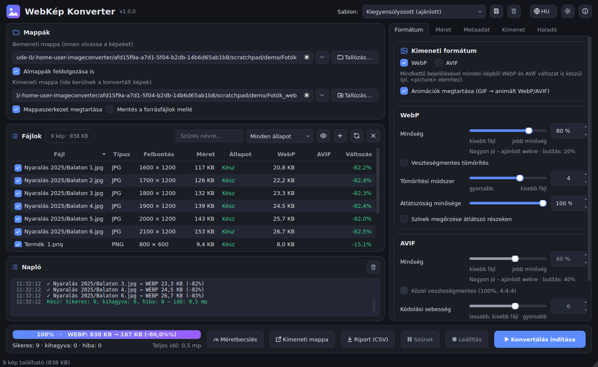
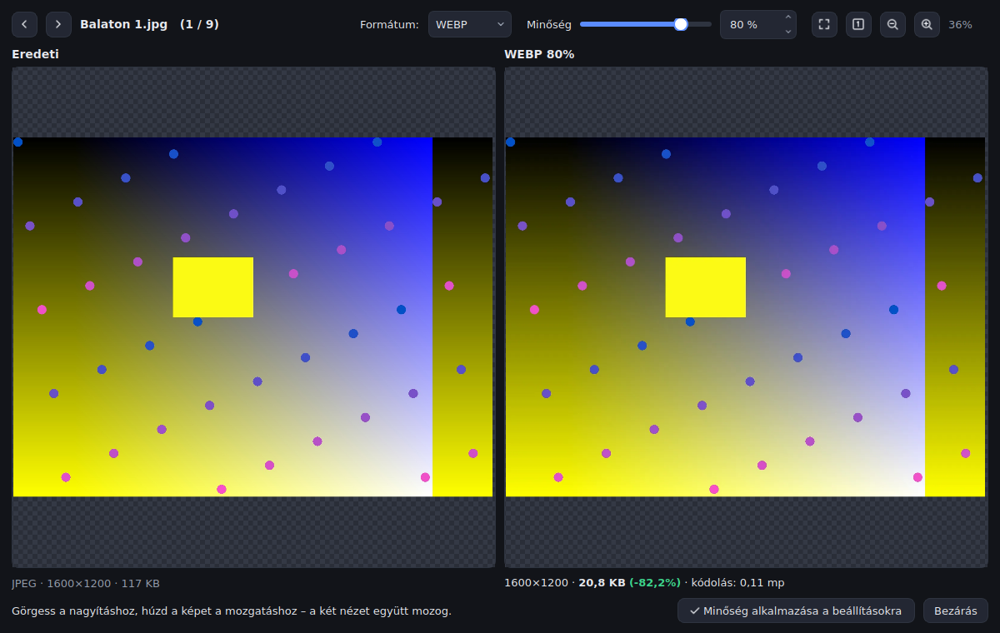

# WebKép Konverter

Professzionális, kötegelt képkonvertáló webre. Egész mappányi **JPG, PNG, BMP, GIF, TIFF, HEIC** (és más) képet alakít át **WebP** és/vagy **AVIF** formátumba – párhuzamosan, a processzor összes magját kihasználva, részletesen szabályozható minőséggel, átméretezéssel, metaadat- és színkezeléssel.

Windowsra egyetlen `.exe`-ként (hordozható változat) vagy telepítővel érhető el.



## Letöltés

Az exe-ket a GitHub Actions automatikusan elkészíti minden feltöltésnél:

1. Nyisd meg a repository **Actions** fülét → **Build** workflow → a legutóbbi sikeres futás.
2. Az oldal alján az **Artifacts** résznél töltsd le a `WebKepKonverter-<verzió>-windows` csomagot.

Verziócímke (pl. `v1.0.0`) feltöltésekor a fájlok a **Releases** oldalon is megjelennek.

| Fájl | Mire való |
|---|---|
| `WebKepKonverter-Setup-<verzió>.exe` | **Telepítő** (ajánlott) – Start menü, asztali ikon, jobb klikkes menü mappákhoz, gyors indulás |
| `WebKepKonverter-Portable-<verzió>.exe` | **Hordozható**, egyetlen exe, telepítés nélkül (pendrive-ról is fut) |
| `webkep-cli-<verzió>.exe` | **Parancssori** változat szkriptekhez, automatizáláshoz |

> Az exe nincs digitálisan aláírva, ezért első indításkor a Windows SmartScreen figyelmeztethet:
> **További információ → Futtatás mindenképp**.

## Funkciók

**Konvertálás**
- Bemenet: JPEG, PNG (APNG is), BMP, GIF, TIFF, HEIC/HEIF (iPhone), WebP, AVIF, ICO, TGA, PNM, JPEG 2000, PSD
- Kimenet: **WebP**, **AVIF** vagy **mindkettő egyszerre** (pl. HTML `<picture>` elemhez)
- **Minőség százalékosan** (0–100%) formátumonként, élő leírással: „Nagyon jó – ajánlott webre · butítás: 20%”
- Veszteségmentes WebP, közel veszteségmentes AVIF
- Haladó kódolóbeállítások: WebP tömörítési módszer (0–6), átlátszóság minősége; AVIF sebesség (0–10), színmintavételezés (4:2:0 / 4:2:2 / 4:4:4)
- **Célméret mód**: képenként automatikusan megkeresi a legjobb minőséget, ami még belefér pl. 100 KB-ba
- „Ne mentse, ha nagyobb lenne, mint az eredeti”
- Animált GIF → animált WebP/AVIF (vagy csak az első képkocka)
- Átlátszóság megőrzése

**Átméretezés**
- Százalékos, fix szélesség, fix magasság, hosszabbik oldal, beillesztés dobozba, **kitöltés és középre vágás** (bélyegképekhez)
- Nagyítás tiltása kisebb képeknél, Lanczos / bikubikus / bilineáris / pixel-art szűrő
- Opcionális élesítés kicsinyítés után
- Gyors JPEG-dekódolás nagy kicsinyítésnél (draft mód)

**Metaadatok és szín**
- Automatikus elforgatás EXIF alapján (telefonos fotók)
- EXIF / XMP megtartása vagy törlése, **GPS helyadatok eltávolítása** (adatvédelem)
- Színprofil: átalakítás **sRGB-re** (Adobe RGB, Display P3 képek helyes színei a böngészőben), megtartás vagy eltávolítás; CMYK képek helyes átalakítása
- Eredeti fájldátum megtartása

**Mappák és fájlnevek**
- Bemeneti és kimeneti mappa választása (tallózás, legutóbbi mappák, fogd és vidd)
- Almappák feldolgozása, **mappaszerkezet megtartása** vagy mentés a forrásfájlok mellé
- Webbarát fájlnevek (`Nyári Fotó 01.JPG` → `nyari-foto-01.webp`), előtag/utótag, kisbetűsítés
- Ütközéskezelés: felülírás, kihagyás, átnevezés, **csak ha a forrás újabb** (gyors frissítés)
- A forrásfájlt soha nem írja felül; a kötegen belüli névütközéseket (pl. `kep.jpg` + `kep.png`) automatikusan feloldja
- Biztonságos írás: megszakításkor sem marad félkész fájl

**Kényelmi és profi funkciók**
- **Előnézet**: eredeti és konvertált kép egymás mellett, szinkronizált nagyítással, élő minőség-csúszkával és pontos fájlmérettel
- **Méretbecslés** mintaképek alapján a konvertálás előtt
- Párhuzamos feldolgozás (állítható szálszám), **szünet / folytatás / leállítás**
- Folyamatjelző hátralévő idővel, sebességgel és élő megtakarítással
- Fájllista szűréssel, rendezéssel, kijelöléssel; hibás képek újrapróbálása egy kattintással
- Összegző ablak és **CSV riport** (Excel-barát)
- Beépített **sablonok** (webes Full HD, blogkép, webshop, bélyegkép, max. 100 KB, veszteségmentes…) és **saját sablonok** mentése
- Sötét és világos téma, **magyar és angol** felület
- Minden beállítás megmarad a következő indításig
- Jobb klikkes menü az Intézőben: „Konvertálás a WebKép Konverterrel” (telepítővel)
- Parancssori változat ugyanazokkal a lehetőségekkel



## Használat

1. **Bemeneti mappa**: válaszd ki (vagy húzd az ablakra) a képeket tartalmazó mappát. A program beolvassa a képeket – almappákkal együtt, ha be van jelölve.
2. **Kimeneti mappa**: ide kerülnek az új fájlok (a program javasol egyet, pl. `Fotók_web`).
3. **Sablon** vagy egyéni beállítások a jobb oldali füleken:
   - *Formátum*: WebP / AVIF, minőség
   - *Méret*: átméretezés
   - *Metaadat*: EXIF, GPS, színprofil
   - *Kimenet*: fájlnevek, ütközéskezelés, célméret
   - *Haladó*: fájltípusok, szálak száma
4. Opcionálisan: **Előnézet** (dupla kattintás egy képen) vagy **Méretbecslés**.
5. **Konvertálás indítása** (Ctrl+Enter).

### Milyen minőséget válasszak?

| Felhasználás | WebP | AVIF |
|---|---|---|
| Fotógaléria, portfólió | 85–92% | 70–80% |
| Általános weboldal (ajánlott) | 75–82% | 55–65% |
| Bélyegkép, háttérkép | 60–75% | 40–55% |
| Logó, grafika, képernyőkép | veszteségmentes | 4:4:4, 80%+ |

Az AVIF skála „erősebb”: az AVIF 60% nagyjából a WebP 80%-ának felel meg, de kb. 20–30%-kal kisebb fájlt ad.

### Billentyűparancsok

| Billentyű | Művelet |
|---|---|
| Ctrl+Enter | Konvertálás indítása |
| Esc | Leállítás |
| F5 | Mappa újraolvasása |
| Ctrl+O / Ctrl+Shift+O | Bemeneti / kimeneti mappa |
| Ctrl+P | Előnézet |
| Ctrl+F | Szűrés a listában |
| F1 | Névjegy |

## Parancssor

```text
webkep-cli kepek -o web
webkep-cli kepek -o web -f webp avif -q 80 --long-edge 1920 --web-safe
webkep-cli kepek -o thumbs --preset thumbnail
webkep-cli kepek -o web --target-kb 150 --report riport.csv
webkep-cli --list-presets
webkep-cli --help
```

Fontosabb kapcsolók: `-f/--format`, `-q/--quality`, `--webp-quality`, `--avif-quality`, `--lossless`, `--percent`, `--width`, `--height`, `--long-edge`, `--fit 1920x1080`, `--fill 400x400`, `--sharpen`, `--keep-exif`, `--keep-gps`, `--color srgb|keep|strip`, `--web-safe`, `--prefix`, `--suffix`, `--on-conflict overwrite|skip|rename|update`, `--beside-source`, `--flat`, `-j/--workers`, `--dry-run`, `--lang en`.

Kilépési kód: `0` siker, `1` volt hibás kép, `2` hibás paraméter, `130` megszakítva (Ctrl+C).

## Beállítások helye

- Telepített / normál futtatás: `%APPDATA%\WebKepKonverter\settings.json`
- **Hordozható mód**: ha az exe mellett van egy `portable.txt` nevű fájl, a beállítások az exe melletti `settings` mappába kerülnek (pendrive-hoz ideális).

## Fejlesztés és build

Követelmény: Python 3.10+ (a build 3.12-vel készül).

```bash
python -m venv .venv
.venv\Scripts\activate          # Linux/macOS: source .venv/bin/activate
pip install -r requirements-dev.txt
python -m webkep                # grafikus felület
python -m webkep.cli --help     # parancssor
python -m pytest                # tesztek
```

Windows exe helyben: futtasd a **`build.bat`**-ot. Ez virtuális környezetet hoz létre, lefuttatja a teszteket, elkészíti a `dist\` mappába a hordozható exe-t, a mappás változatot és a parancssori exe-t, majd – ha telepítve van az [Inno Setup 6](https://jrsoftware.org/isdl.php) – a telepítőt is (`installer_output\`).

Új kiadás: növeld a verziót a `webkep/__init__.py`-ban, majd tölts fel egy `v<verzió>` címkét (pl. `git tag v1.0.1 && git push --tags`) – a workflow elkészíti a GitHub Release-t.

### Felépítés

```
webkep/
  core/         GUI-független mag: beállítások, beolvasás, konvertálás, kötegelés, riport
  gui/          PySide6 (Qt) felület: főablak, beállítópanel, előnézet, téma
  cli.py        parancssori felület
  i18n.py       magyar / angol szövegek (_strings.py)
packaging/      PyInstaller spec, Inno Setup telepítő, ikon-generátor
tests/          pytest tesztek (mag, CLI és GUI)
```

## Licencek

A felhasznált külső könyvtárak licencei: [THIRD_PARTY_NOTICES.md](THIRD_PARTY_NOTICES.md).
